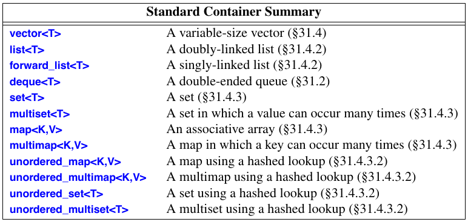

# Lecture 2: C++ introduction (cont.), implementation tasks

# O() - notation
<table>
<thead>
    <tr>
        <td>
            <b>Equality</b>
        </td>
        <td>
            <b>Explanation</b>
        </td>
    </tr>
</thead>
<tbody>
    <tr>
        <td>O(2n) = O(n)</td>
        <td>removing constants</td>
    </tr>
    <tr>
        <td>O(log<sub>2</sub>n) = O(log<sub>3</sub>n) = O(logn)</td>
        <td>removing base from logarithm</td>
    </tr>
    <tr>
        <td>O(n<sup>2</sup> + n + nlogn) = O(n<sup>2</sup>)</td>
        <td>the most "dominant" part</td>
    </tr>
</tbody>
</table>

# Simple Containers:

These include:
* ```list```
* ```vector```
* ```queue```
* ```stack```
* ```deque```
* ```string```

It is crucial to choose a **right** container when solving competitive programming tasks.

For each container type you should have an idea of **how** it works and **what's under the hood**. This will help you to understand the **complexity** of each operation performed on the container.

## Materials:
* on ```string```, ```vector```: [pdf](Materials/StringVectorPair.pdf)
* on ```stack```, ```queue```: [pdf](Materials/StacksQueuesPriorityQueue.pdf)

**NOTE**: These pdfs contains my notes and tips. I had some issues with displaying them. I recommend using **Adobe Acrobat Reader** under **Windows** and **Okular** under **Linux** or **MAC**.

## deque
Same as ```queue```, but you can add elements both at the beginning or end of it. You can also delete from the beginning or end. All these operations are **amortized constant** in complexity.
```cpp
#include <iostream>
#include <deque>

using namespace std;

int main(){
    deque<int> d;

    cout << d.empty();      // true
    cout << d.size();       // 0

    d.push_back(1);

    cout << d.size();       // 1

    d.push_front(2);

    cout << d.front();      // 2
    cout << d.back();       // 1

    d.pop_front();         // does NOT return
    d.pop_back();          // does NOT return

    cout << d.empty();     // true
}
```

# Not Simple Containers
We will see these containers in depth at the next lecture. Now I will just give you an intuition.

## Binary Search Tree


## Red-Black Tree, set, map
**Red-Black tree** is **self-balancing** binary search tree, where the height is always **less** than **2log<sub>2</sub>(n)**

## Hashing, unordered_set, unordered_map

More on next lectures

# Containers Summary


# Problems
Some implementation problems from [Uzhgorod Programming Summer School 2019](http://codeschool.uzhnu.edu.ua/en) can be found here: [pdf](Materials/Statements.pdf). Unfortunately it's impossible to submit them :(

There is also a contest on [vjudge](https://vjudge.net/contest/340937) on using containers. Password: ```47```

# Tips from the last contest

## Passing arrays inside functions
```cpp
void fib_digit(int fib_form[41]){...}
```
It is not a good idea. Use global arrays instead or some container.

## string.length()
Use ```string.size()``` method instead - it is common interface for all the containers in C++.

## Converting integer to string
```cpp
int number; cin >> number;
string str_num = to_string(number);
```

**P.S.** You could just read a string from ```cin```.
If you need conversion from ```string``` to some integral type or vice versa, there is more unified approach.
```cpp
int number; cin >> number;

stringstream strm;

strm << number;

string str_num;
strm >> str_num;
```

## Don't write your own min/max function
There is ```min```/```max``` support in C++
```cpp
#include <algorithm>

using namespace std;

int main(){
    int a = 2;
    int b = 3;

    int c = max(a, b);
    int d = min(a, b);
}
```
**Note:** both arguments should have **the same** type (i.e. 2 ```int```s, 2 ```double```s, 2 ```long```s).

## **ARRAYS SHOULD HAVE CONSTANT SIZE!!!**
```cpp
int n;
cin >> n;
int array[n][n];
```
That's **INCORRECT**!!!

## Other Tips
* ```int const N = 3;``` ====> ```const int N = 3;```
* ```long``` and ```long long``` are different types
* avoid magical constants
* ```used_letters[int(i) - int('A')]``` ====> don't need to cast ```char``` to ```int```
