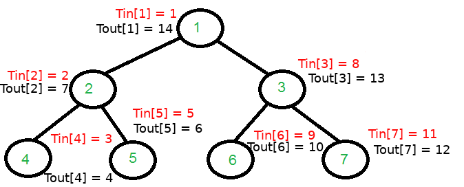
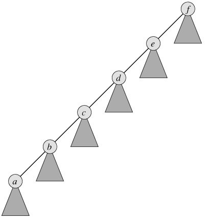

# Lecture 7: Graph Theory (cont.)

# Lowest Common Ancestor (lca)

See theory on [e-maxx](https://e-maxx.ru/algo/lca_simpler).


## Part 1: dfs with timer
```cpp
const int kMaxN = 1000000;

int n;
vector<int> g[kMaxN];
int tin[kMaxN];
int tout[kMaxN];
int parent[kMaxN];
int timer;

void dfs (int v, int p) {
    ++timer;
	tin[v] = timer;

    parent[v] = p;

    for(const auto &to: g[v]){
        if(to == parent[v])
            continue;
        dfs(to, v);
    }

    ++timer;
	tout[v] = timer;
}

int main(){
    cin >> n;

    for(int i = 0; i < n - 1; ++i){
        int a, b; cin >> a >> b;
        g[a].push_back(b);
        g[b].push_back(a);
    }

    dfs(1, 1);
}
```



### What for?
For any pair ```(i, j)```, say whether ```i``` is exactly above ```j``` in ```O(1)```?

```cpp
bool upper(int i, int j){
    return tin[i] <= tin[j] && tout[j] <= tout[i];
}
```

## Part 2: Up array
```cpp
const int kMaxLog = 20;

int up[kMaxN][kMaxLog + 1];
```
Meaning: in what vertex will you end up if you go **2<sup>i</sup>** vertices up from vertex ```i```.
* **up[4][0]** ---> 1 vertex up from 4 is **2**
* **up[4][1]** ---> **1**
* **up[5][0]** ---> **2**
* **up[1][0]** ---> **1**
* **up[1][3]** ---> **1**
* **up[4][2]** ---> **1**

How to fill it?

```cpp
void fillup(){
    for(int i = 1; i <= n; ++i)
        up[i][0] = parent[i];
    
    for(int l = 1; l <= kMaxLog; ++l)
        for(int i = 1; i <= n; ++i)
            up[i][l] = up[up[i][l - 1]][l - 1]; // MOST CRUCIAL TO UNDERSTAND
}
```

Finally, lca itself:
```cpp
int lca(int a, int b) {
	if (upper(a, b))return a;
	if (upper(b, a))return b;

	for (int i = kMaxLog; i >= 0; i--) {
		if (!upper(up[a][i], b))
            a = up[a][i];
	}

	return up[a][0];
}
```

## Asymptotics
Preprocessing: ```O(nlogn)```

One run of lca(): ```O(logn)```

## Applications:
**Problem:** Given ```m``` queries, find the distance between node ```i``` and ```j``` in the tree:

```cpp
int ans(int i, int j){
    int l = lca(i, j);
    int res = distance[i] + distance[j] - 2 * distance[l];
    return res;
}
```

Where ```distance[i]``` is distance between ```root``` and  ```i``` (can be calculated with one ```dfs```).

## Problems:

**Problem:** [A, Attack on Alpha-Zet](https://codeforces.com/gym/102021)

# Disjoint Set Union, Kruskal's Algorithm

See theory on [e-maxx](https://e-maxx.ru/algo/mst_kruskal_with_dsu).

**Minimum spanning tree:**


## Kruskal's Algorithm:
1. Sort all the edges in a graph by its weight
2. Start with an empty graph (graph with no edges)
3. For each edge in a sorted list from 1
    * Let ```a```, ```b``` be endpoints of the edge
    * If ```a```, ```b``` are in the same connected component, skip this edge
    * Otherwise add this edge to the spanning tree


But how do I know whether ```a``` and ```b``` are in the same component?

It is expensive to run ```dfs``` every time.

## Disjoint Set Union

See theory on [e-maxx](https://e-maxx.ru/algo/dsu).

At the beginning you have ```n``` items, each of the items forms its own set:
```
    Example: n=5
        set([1])
        set([2])
        set([3])
        set([4])
        set([5])
```

2 types of queries:

1. Given to items ```a``` and ```b``` check whether ```a``` and ```b``` are in the same set
2. Given to items ```a``` and ```b```, merge ```s1``` and ```s2``` where ```s1``` is a set, that contains ```a``` and ```s2``` is a set, that contains ```b```

```
    Check(1, 2) -> false

    Merge 2, 3
        set([1])
        set([2, 3])
        set([4])
        set([5])
    
    Check(1, 2) -> false
    Check(2, 3) -> true

    Merge 2, 5
        set([1])
        set([2, 3, 5])
        set([4])

    Merge 1, 4
        set([1, 4])
        set([2, 3, 5])
    
    Check(2, 5) -> true
    Check(1, 3) -> false

    Merge 4, 3
        set([1, 2, 3, 4, 5])
```


Concept: each item has its leader.

Then checking become trivial:
```cpp
bool check(int a, int b){
    return leader(a) == leader(b);
}
```

But what's ```leader()```???

```cpp
const int kMaxN = 1000000;

int n;
int parent[kMaxN];

int leader(int a){
    while(parent[a] != a)
        a = parent[a];
    return a;
}

void merge(int a, int b){
    a = leader(a);
    b = leader(b);

    if(a == b)
        return;
    
    parent[a] = b;
}

int main(){
    int n; cin >> n;
    for(int i = 1; i <= n; ++i)
        parent[i] = i;
    
    // here handle queries
}
```

## Problems?


## Heuristics
### 1. Path compression

```cpp
int leader(int a){
    if(parent[a] == a)
        return a;
    int res = leader(parent[a]);
    parent[a] = res;
    return res;
}
```

### 2. Rank heuristics (height of the tree)
```cpp
int rank[kMaxN]; // height of the tree, at the beginning rank is 0 for every item

void merge(int a, int b){
    a = leader(a);
    b = leader(b);

    if(a == b)
        return;
    
    if(rank[a] > rank[b]){
        parent[b] = a;
        return;
    }
    if(rank[b] > rank[a]){
        parent[a] = b;
        return;
    }
    ++rank[a];
    parent[b] = a;
}
```

### 3. Rank heuristics (size of subtree)

## Asymptotics
```O(logn)``` per query (either ```leader()``` and ```merge()```).

## Problems
**Problem:** [Minimum Spanning Tree](https://www.e-olymp.com/en/problems/981)

# Tree Traversals

See good article on [geeksforgeeks](https://www.geeksforgeeks.org/tree-traversals-inorder-preorder-and-postorder/).

We will talk about <i>binary</i> trees in this section.

Can we think of more comfortable representation?

```cpp
const int kMaxN = 1000000;

vector<int> g[kMaxN];

int leftt[kMaxN]; // 0 means no son
int rightt[kMaxN]; // 0 means no son

void dfs(int v, int p){
    bool wasLeft = false;

    for(const auto &to: g[v])
        if(to != p)
        {
            if(!wasLeft){
                wasLeft = true;
                leftt[v] = to;
            }
            else{
                rightt[v] = to;
            }

            dfs(to, v);
        }
}

int main(){
    // read the graph...

    int root = 1;
    dfs(root, root);
}
```

Ok, now we have more comfortable representation with ```leftt``` and ```right``` arrays. What about the tree traversals?

## Inorder Traversal (LNR)
```
1. visit left subtree
2. visit root
3. visit right subtree
```

```cpp
vector<int> inorder_traversal;

void inorder(int v){
    if(leftt[v] != 0)
        inorder(leftt[v]);
    inorder_traversal.push_back(v);
    if(rightt[v] != 0)
        inorder(rightt[v]);
}
```

### What for?
For binary search tree ```Inorder``` yields a <i>sorted</i> array.

## Preorder Traversal (NLR)

Root, left subtree, right subtree.

Code is almost the same as ```inorder``` just change the lines.

### What for?
Copying of the tree (i.e. copy the ```root```, then recursively copy ```left``` and ```right``` subtrees).

## Postorder Traversal (LRN)

Left subtree, right subtree, root.

### What for?

Deletion of the tree (i.e. recursively delete ```left``` and ```right``` subtree and then a root).


# Topics NOT covered on the lecture, but you should know this
* Ford-Bellman (read more on [e-maxx](http://e-maxx.ru/algo/ford_bellman))
