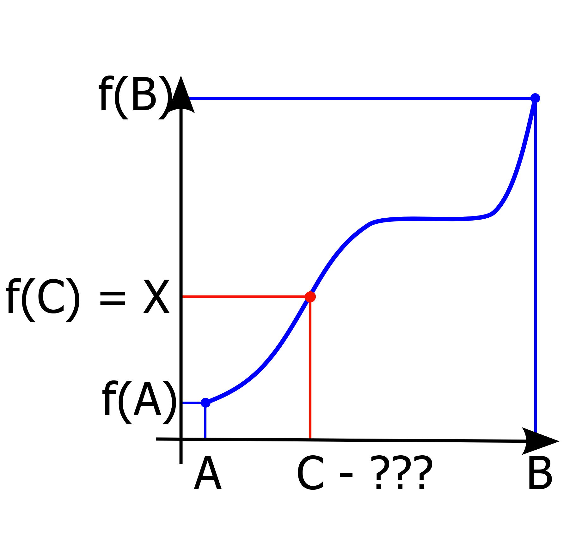

# Lecture 8: Binary Search, Dynamic Programming

# Binary Search

## Finding element in array

**Problem:** Given a **SORTED** array and number ```X```, find whether ```X``` is in the array or not.

**Hint:**
1. You should use the fact, that array is sorted
2. Your algorithm should be faster than simple linear search
3. You should not use any preprocessing

**Example:**
```
    arr = [1, 3, 5, 6, 10]

    X = 7   ---> false
    X = 5   ---> true
    X = 1   ---> true
    X = -10 ---> false
    X = 8   ---> false
```

**Solution:**
1. At first we are considering the whole array (```l = 0, r = n - 1```)

While (```r - l > 0```)

2. Find the middle index ```m = (l + r) / 2```
3. if (```arr[m] == X```) then we found the element
4. if (```arr[m] > X```) then ```r = m```
5. if (```arr[m] < X```) then ```l = m```
6. go to step 2. and repeat

**Code:**
```cpp

int n = 5;
int arr[] = {1, 3, 5, 6, 10};

bool find_in_array(int X)
{
    int l = 0;
    int r = n - 1;

    while(r - l > 1)
    {
        int m = (l + r) / 2;
        if(arr[m] == X)
            return true;
        if(arr[m] > X)
            r = m;
        else
            l = m;
    }

    if(arr[l] == X || arr[r] == X)
        return true;
    return false;
}
```

**Observation:**

After each iteration of the algorithm (steps ```2. 3. 4. 5.```) length of the segment reduces by half.

It means, that pretty soon (i.e. in **logarithmic** time) legth of the segment will be ```1```.

**Observation:**

We can throw away left/right part of the segment only because we know, that array is **SORTED**.

**Complexity:**
```O(logn)```

## Monotonic Function

**Problem:** given a **MONOTONIC**, **CONTINUOUS** function ```f``` defined on ```[A; B]``` and some real number ```X: f(A) <= X <= f(B)```, find a point ```C``` such that ```f(C) = X``` with some precition (i.e. 10<sup>-6</sup>) using as few function evaluations as possible (i.e. you don't know the exact function ```f```, you can just evaluate it at some points).



```cpp

double f(double x){
    // black box
}

double find_value()
{
    double l = A;
    double r = B;

    // NOTE no conditions as in previous task
    for(int t = 0; t < 450; ++t)
    {
        double m = (l + r) / 2;
        if(f(m) < X)
            l = m;
        else
            r = m;
    }

    return (l + r) / 2;
}
```

## Other binary search problems:

All problems become simple as soon as you find out the function ```f```, which is not directly stated in the statement.

## Problems:

**Problem:** [Депутатські краватки](https://algotester.com/en/ArchiveProblem/Display/8)

**Problem:** [C, K-Dominant Character](http://codeforces.com/problemset/problem/888/C)

**Problem:** [C, Sad Powers](http://codeforces.com/problemset/problem/955/C)

**Problem:** [D, Monitor](http://codeforces.com/problemset/problem/846/D)

**Problem:** [Archi and Barik](./Materials/Problem.jpg) (sorry for poor quality)

# Dynamic Programming

**Motto:** solve lots of smaller subproblems to obtain a solution for a given problem.

It's too abstract for now, but you will see the idea in action pretty soon.

## Longest Increasing Subsequence

**Problem:** given an array of ```n``` integers, find the length of its longest increasing subsequence.

For example:

```
arr:
    [1, 4, 3, 2, 5, 10, 2, 2]

longest increasing subsequence:
    [1, 2, 5, 10]

answer:
    4
```

**Solution:**
Let's have an array ```dp[n]```, where ```dp[i]``` will store a length of longest increasing subsequence, ```that ends with ith element of the array```.

So in our case:

```
    dp[0] ---> [1]                       ---> 1
    dp[1] ---> [1, 4]                    ---> 2
    dp[2] ---> [1, 4, 3]                 ---> 2
    dp[3] ---> [1, 4, 3, 2]              ---> 2
    dp[4] ---> [1, 4, 3, 2, 5]           ---> 3

    etc.

    Note:
    dp[7] ---> [1, 4, 3, 2, 5, 10, 2, 2] ---> 2
```

So, here is an idea in action: we are solving lots of smaller subproblems in order to obtain a solution for our problem, which is ```max(dp)```.

But how do I fill ```dp```?

```cpp
const int n = 8;
int arr[] = {1, 4, 3, 2, 5, 10, 2, 2};

int dp[8];

void filldp(){
    dp[0] = 1;
    for(int i = 1; i < n; ++i){
        dp[i] = 1;
        for(int j = 0; j < i; ++j)
            if(arr[j] < arr[i])
                dp[i] = max(dp[i], dp[j] + 1);
    }
}

```

**Runtime:** ```O(n * n)```

**Spoiler:** This problem can be solved in ```O(n logn)```, we will talk about it on the next lecture.

**Problem:** Can we restore the actual subsequence??? (yes)

## DP on trees

See tutorial [here](https://codeforces.com/blog/entry/20935) (Problem 1 in particular).

**Problem:** given a tree ```T``` of ```N``` nodes, where each node ```i``` has ```Ci``` coins attached with it. You have to choose a ```subset``` of nodes such that ```no two adjacent nodes are chosen``` and ```sum``` of coins attached with nodes in chosen subset is ```maximum```.

What ```dp``` should we use?

```
dp[N][2];
```

```dp[i][0]``` ---> maximum value in subtree of node ```i```, given that we did **NOT** take node ```i``` in a resulting subset.

```dp[i][1]``` ---> maximum value in subtree of node ```i```, given that we took node ```i``` in a resulting subset.

**Transitions:**
1. ```dp[i][1]``` ---> take the root ```i``` and don't take all its children (no adjacent nodes are allowed)
2. ```dp[i][0]``` ---> don't take the root ```i``` and either take or don't take each of it's children (choose max)

```cpp
const int kMaxN = 1000000;

vector<int> g[kMaxN];
int price[kMaxN];

void dfs(int v, int p){
    for(const auto &to: g[v])
        if(to != p)
            dfs(to, v);

    // on this line we know dp for all children of node v
    
    dp[v][1] = price[v];
    for(const auto &to: g[v])
        if(to != p)
            dp[v][1] += dp[v][0];
    
    dp[v][0] = 0;
    for(const auto &to: g[v])
        if(to != p)
            dp[v][0] += max(dp[to][0], dp[to][1]);
}

int main(){
    // read the graph
    // ...

    int root = 1;
    dfs(root, -1);

    int ans = max(dp[root][0], dp[root][1]);
}
```

**Complexity:** ```O(n)```

## Knapsack problem

**Problem:** given a set of items, each with a weight and a value, determine the number of each item to include in a collection so that the total weight is less than or equal to a given limit and the total value is as large as possible.


## 0/1 Knapsack

<table>
<thead>
    <tr>
        <td>Item↓/Weight→</td>
        <td>0</td>
        <td>1</td>
        <td>2</td>
        <td>3</td>
        <td>4</td>
        <td>5</td>
        <td>6</td>
        <td>7</td>
        <td>8</td>
        <td>9</td>
        <td>10</td>
        <td>11</td>
        <td>12</td>
        <td>13</td>
        <td>14</td>
        <td>15</td>
    </tr>
</thead>
<tbody>
    <tr>
        <td>Nothing in <br> the knapsack</td>
        <td>0$</td>
        <td>-</td>
        <td>-</td>
        <td>-</td>
        <td>-</td>
        <td>-</td>
        <td>-</td>
        <td>-</td>
        <td>-</td>
        <td>-</td>
        <td>-</td>
        <td>-</td>
        <td>-</td>
        <td>-</td>
        <td>-</td>
        <td>-</td>
    </tr>
    <tr>
        <td>1kg, 2$</td>
        <td>0$</td>
        <td>2$</td>
        <td>-</td>
        <td>-</td>
        <td>-</td>
        <td>-</td>
        <td>-</td>
        <td>-</td>
        <td>-</td>
        <td>-</td>
        <td>-</td>
        <td>-</td>
        <td>-</td>
        <td>-</td>
        <td>-</td>
        <td>-</td>
    </tr>
    <tr>
        <td>4kg, 10$</td>
        <td>0$</td>
        <td>2$</td>
        <td>-</td>
        <td>-</td>
        <td>10$</td>
        <td>12$</td>
        <td>-</td>
        <td>-</td>
        <td>-</td>
        <td>-</td>
        <td>-</td>
        <td>-</td>
        <td>-</td>
        <td>-</td>
        <td>-</td>
        <td>-</td>
    </tr>
    <tr>
        <td>1kg, 1$</td>
        <td>0$</td>
        <td>2$</td>
        <td>3$</td>
        <td>-</td>
        <td>10$</td>
        <td>12$</td>
        <td>13$</td>
        <td>-</td>
        <td>-</td>
        <td>-</td>
        <td>-</td>
        <td>-</td>
        <td>-</td>
        <td>-</td>
        <td>-</td>
        <td>-</td>
    </tr>
    <tr>
        <td>2kg, 2$</td>
        <td>0$</td>
        <td>2$</td>
        <td>3$</td>
        <td>4$</td>
        <td>10$</td>
        <td>12$</td>
        <td>13$</td>
        <td>14$</td>
        <td>15$</td>
        <td>-</td>
        <td>-</td>
        <td>-</td>
        <td>-</td>
        <td>-</td>
        <td>-</td>
        <td>-</td>
    </tr>
    <tr>
        <td>12kg, 4$</td>
        <td>0$</td>
        <td>2$</td>
        <td>3$</td>
        <td>4$</td>
        <td>10$</td>
        <td>12$</td>
        <td>13$</td>
        <td>14$</td>
        <td>15$</td>
        <td>-</td>
        <td>-</td>
        <td>-</td>
        <td>4$</td>
        <td>6$</td>
        <td>7$</td>
        <td>8$</td>
    </tr>
</tbody>
</table>

**Note:** you each time you only need a previous row.

Hence, you do **NOT** need to store the whole table.

```cpp
const int kMaxM = 1000;

bool possible[2][kMaxM + 1];
int price[2][kMaxM + 1];

vector<pair<int, int>> items; // weight, price

int noww = 0, prevv = 1;

void knapsack()
{
    possible[prevv][0] = true;
    price[prevv][0] = 0;

    for(const auto &it: items)
    {
        // copy the previous row to the current one
        for(int i = 0; i <= kMaxM; ++i){
            possible[noww][i] = possible[prevv][i];
            price[noww][i] = price[prevv][i];
        }

        int itemWeight = it.first;
        int itemPrice = it.second;

        for(int i = 0; i <= kMaxM; ++i)
            if(possible[prevv][i])
                if(i + itemWeight <= kMaxM){
                    possible[noww][i + itemWeight] = true;
                    price[noww][i + itemWeight] = max(price[noww][i + itemWeight], price[prevv][i] + itemPrice);
                }
        
        swap(noww, prevv);
    }
}
```

**Runtime:** ```O(n * m)```

Can you do it using just 1 array instead of 2? (yes)

```cpp
bool possible[kMaxM];
int price[kMaxM];

void unlimited_knapsack(){
    possible[0] = true;
    price[0] = 0;

    for(const auto &it: items){
        int itemWeight = it.first;
        int itemPrice = it.second;

        // NOTE: REVERSE DIRECTION IN THE LOOP
        for(int i = kMaxM; i >= 0; --i)
            if(possible[i])
                if(i + itemWeight <= kMaxM){
                    possible[i + itemWeight] = true;
                    price[i + itemWeight] = max(price[i + itemWeight], price[i] + itemPrice);
                }
    }
}
```

**Problem:** [KNAPSACK - The Knapsack Problem](https://www.spoj.com/problems/KNAPSACK/)

## Unlimited knapsack

Repetitions of items are allowed:
```cpp
bool possible[kMaxM];
int price[kMaxM];

void unlimited_knapsack(){
    possible[0] = true;
    price[0] = 0;

    for(const auto &it: items){
        int itemWeight = it.first;
        int itemPrice = it.second;

        for(int i = 0; i <= kMaxM; ++i)
            if(possible[i])
                if(i + itemWeight <= kMaxM){
                    possible[i + itemWeight] = true;
                    price[i + itemWeight] = max(price[i + itemWeight], price[i] + itemPrice);
                }
    }
}
```

**Problem:** [DBALLZ - Help the Heroes](https://www.spoj.com/problems/DBALLZ/)

## Tiling with Dominoes (easy)

Read the full tutorial on [geeksforgeeks](https://www.geeksforgeeks.org/tiling-with-dominoes/).

**Problem:** Given a ```3 x n``` board, find the number of ways to fill it with ```2 x 1``` dominoes.

**Example:**


**Note:** B<sub>n</sub> and C<sub>n</sub> are the same (they are summetric)


**Final recurrence:**
1. A<sub>n</sub> = A<sub>n - 2</sub> + 2 B<sub>n - 1</sub>
2. B<sub>n</sub> = A<sub>n - 1</sub> + B<sub>n - 2</sub>

**Base cases:**
1. A<sub>0</sub> = 1
2. A<sub>1</sub> = 0
3. B<sub>0</sub> = 0
3. B<sub>1</sub> = 1

Can be calculated in **linear** or **logarithmic** time(like fibonacci numbers matrix approach).

**Problem:** [Триміно](https://www.e-olymp.com/uk/problems/236)

## Tiling with Dominoes (hard)

Now we tile the board ```n x m```, but ```n * m <= 100```

Tutorial on [e-maxx](http://e-maxx.ru/algo/profile_dynamics).

More about tiling dominoes problem in this [pdf](Materials/DPTiling.pdf) (language - russian).

**Problem:** [Tiling Dominoes](https://onlinejudge.org/index.php?option=com_onlinejudge&Itemid=8&page=show_problem&problem=2245)

More on the lecture.

## Other DP Problems

* [ANARC05B - The Double HeLiX](https://www.spoj.com/problems/ANARC05B/en/)
* [C, Square Subsets](https://codeforces.com/contest/895/problem/C?locale=en)
* [I, Inversion](https://codeforces.com/gym/101964/problem/I)
