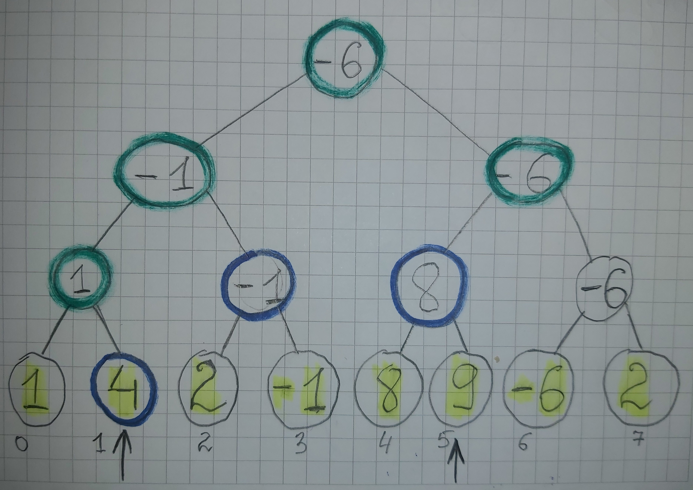
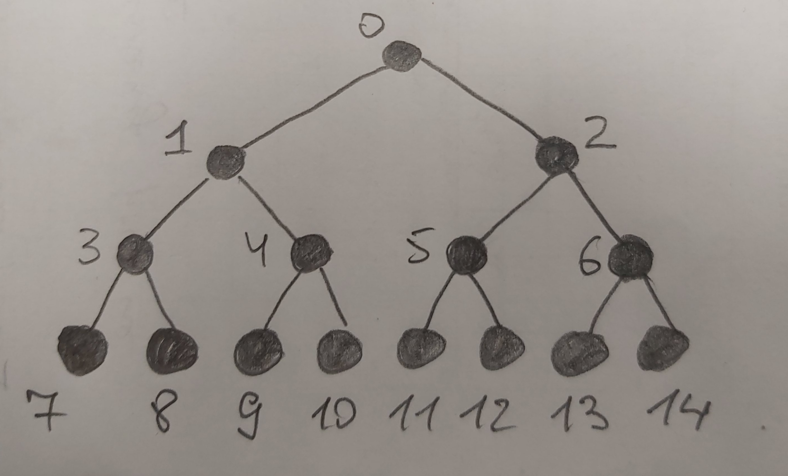
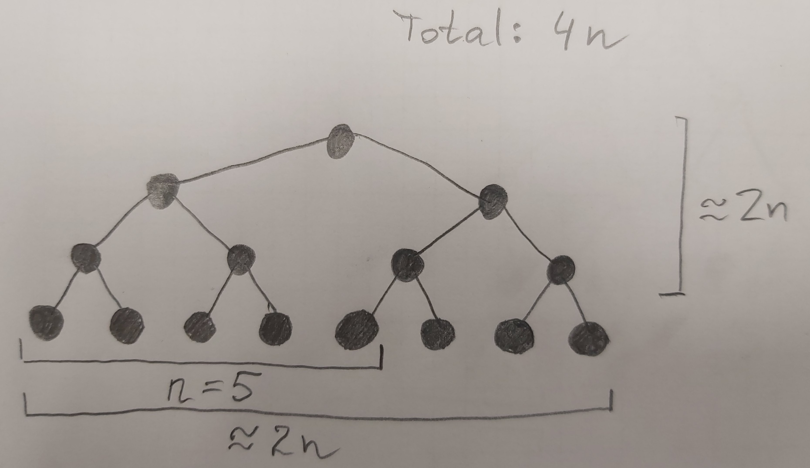

# Lecture 9: SQRT Decomposition, Mo's Algorithm, Segment Tree

# Warmup

## Problem
You are given an integer array ```arr``` of size ```n```. Every element of the array is given in advance.

There are ```m``` queries of the form ```(i, j), 0 <= i <= j < n```. Your task is to find the **sum** of ```arr``` elements with indexes from ```i``` to ```j```.

```n, m``` <= 10<sup>6</sup>

```arr[i]``` <= 10<sup>9</sup>

## Example
```
    n = 6
    arr = [0, -2, 5, 2, -1, 4]

    Query (0, 1) ---> -2
    Query (2, 3) ---> 7
    Query (3, 5) ---> 5
    Query (0, 0) ---> 0
```

## Hint
* use the fact, that every ```arr[i]``` never changes and use some preprocessing

## Solution
prefix sums

## Complexity
```O(n + m)```

# SQRT decomposition

Read tutorial on [e-maxx](https://e-maxx.ru/algo/sqrt_decomposition).

Read tutorial on [geeksforgeeks](https://www.geeksforgeeks.org/sqrt-square-root-decomposition-technique-set-1-introduction/).

## Problem
You are given an integer array ```arr``` of size ```n```. Every element of the array is given in advance.

There are ```m``` queries of 2 types:
1. ```(i, j)```     ---> get sum of ```arr[k], k in [i; j]```
2. ```(i, new_val)``` ---> set ```arr[i] = new_val```

You can find this problem online on [algotester](https://algotester.com/en/ArchiveProblem/Display/40148).

## Example
```
    n = 6
    arr = [0, -2, 5, 2, -1, 4]

    Query (0, 1) ---> -2
    Change (1, 2)
    Query (0, 1) ---> 2
    Query (2, 3) ---> 7
    Query (1, 3) ---> 9
    Query (3, 5) ---> 5
```

## Idea
split an array in multiple **blocks**. Calculate sum of elements of each block and keep them up-to date (i.e. update on each query if necessary).


Let the size of block be ```k``` (we will talk about what ```k``` to choose later).

## So what?

Solving query **1.**


Solving query **2.** is straightforward: update block value and array value.

## Complexity
1. Query of type **1.**: ```O(2 * k + (n / k))```
2. Query of type **2.**: ```O(1)```

## What k to choose?
It is not hard to prove that choosing ```k = sqrt(n)``` will minimize complexity of solving query **1.**, which will become ```O(sqrt(n))```

Overall complexity: ```O(m * sqrt(n))```

## Note:
You don't need to calculate square root of ```n``` explicitly. Square root of **maximum** ```n``` will be just enough.

It means, that if ```n``` <= 10<sup>6</sup>, then you can have blocks of fixed size ```sqrt(1 000 000) = 1000```.

# SQRT decomposition: add on subarray

## Task
You are given an integer array ```arr``` of size ```n```. Every element of the array is given in advance.

2 types of queries:
1. ```(i, j)```     ---> get sum of ```arr[k], k in [i; j]```
2. ```(i, j, value)```     ---> for every ```k in [i; j]``` set ```arr[k] += value```

## Solution
For each block hold an integer ```a``` - how much should we add on this block (more on the lecture).

# Online vs Offline task
In a nutshell:

## Offline Tasks
All the queries are given in advance in input

It means, that you can reorder the queries as you like (to reduce time complexity of your algorithm).

Be aware, that you need to answer the queries in the **ORIGINAL** order.

## Online Tasks
All the queries are **NOT** given in advance: in order to solve query ```i``` you should have an answer to query ```i - 1```.

# MO's algorithm
Suitable only for **OFFLINE** tasks.

Read tutorial [here](https://blog.anudeep2011.com/mos-algorithm/).

## Problem
[B, Little Elephant and Array](https://codeforces.com/contest/220/problem/B).

Please, read the statement before moving to the next section.

## Approach
If we know the answer for ```[l; r]``` - can we quickly calculate the answer for ```[l; r + 1]```?

It turns out we can:
```cpp
const int kMaxN = 100000;
int n;
int arr[kMaxN];

int ans, l, r; // all of these will be filled in the process
unordered_map<int, int> cnt;

void incr(){
    ++r;
    
    ++cnt[arr[r]];

    if(cnt[arr[r]] == arr[r])
        ++ans;
    if(cnt[arr[r]] == arr[r] + 1)
        --ans;
}
```

So, we can get from ```[l; r]``` to ```[l; r + 1]``` in **constant** time.

We can write similar functions to transition to the other queries:
* ```[l; r]``` ---> ```[l; r + 1]```
* ```[l; r]``` ---> ```[l + 1; r]```
* ```[l; r]``` ---> ```[l - 1; r]```
* ```[l; r]``` ---> ```[l; r - 1]```

## Silly Approach

Solve each query by going multiple times from the previous one:

Example:
```
    Query 1: (3, 5)
    Query 2: (1, 4)

    Transitions will look like follows:
    (3, 5) --> (2, 5) --> (1, 5) --> (1, 4)
```

It's runtime is quite bad (you need ```O(n)``` to get to the other query, which will lead to ```O(n * m)``` solution).

## MO's algorithm
What if we reorder the queries and use the same approach?

Quote from [Anudeep's blog](https://blog.anudeep2011.com/mos-algorithm/#disqus_thread):
```
How does the final order look like?

All the queries are first ordered in ascending order of their block number
(block number is the block in which its opening falls).
Ties are ordered in ascending order of their R value.

For example consider following queries and assume we have 3 blocks each of size 3.

{0, 3} {1, 7} {2, 8} {7, 8} {4, 8} {4, 4} {1, 2}

Let us re-order them based on their block number.
{0, 3} {1, 7} {2, 8} {1, 2} {4, 8} {4, 4} {7, 8}

Now let us re-order ties based on their R value.
{1, 2} {0, 3} {1, 7} {2, 8} {4, 4} {4, 8} {7, 8}
```

As in SQRT decomposition, block has size ```sqrt(n)```

## Complexity?
The final complexity consist of 2 parts:
1. queries, left boundaries of which lies **the same block**
2. queries, left boundaries of which are in neighbouring blocks (there will be ```sqrt(n)``` such pairs)

### Complexity analysis - inside on 1 block
* as the right bound is sorted, it will advance maximum ```n``` times.
* as the left boundaries lie in the same block, each time it will move max on ```sqrt(n)```

### Complexity analysis - neighbouring blocks
* right bound will advance max ```n``` times
* left bound advances max on ```2 * sqrt(n)```, as it lies in the neighbouring block

Final complexity: ```O(n * sqrt(n) + m * sqrt(n))```

## Solution of the problem - full code piece:

To be filled on the lecure.

# Segment Tree

Read tutorial on [e-maxx](http://e-maxx.ru/algo/segment_tree).

## Problem
You are given an integer array ```arr``` with ```n``` elements.

You should handle ```m``` queries of 2 types:
1. ```(i, j)``` ---> ```min(arr[i], arr[i + 1], ... arr[j - 1], arr[j])``` (minimum of subarray)
2. ```(i, new_val)``` ---> set ```arr[i] = new_val```

It's **online** task.

Example:
```
    arr = [1, 4, 2, -1, 8, 9, -6, 2]

    Query(0, 2) ---> 1
    Query(0, 7) ---> -6
    Set(0, -100)
    Query(0, 3) ---> -100
    Query(2, 4) ---> -1
```

## Idea
Build the following tree:


Yellow nodes represent our array. Value in other nodes are ```minimum``` among left and right sons. Hence, each node is responsible for minimum on some subarray.

There are ```~2n``` nodes in this tree.

**Build complexity:** ```O(n)```

## Solving query 1



Start from the root. If it exactly cover subarray we are looking for, return value of the root.

Else, go to left and right sons, and repeat.

Here, nodes that are splitted are covered in green, while blue ones are terminal (subarray they are responsible for is in query subarray).

## Solving query 2
Straightforward: go to the particular element and update each node on the way.

## Complexity
On each level of the tree there will be max **4** nodes affected (more on emaxx).

Hence, the complexity of each query will be ```O(logn)```

## How to code it?
Use the following node numbering:



### Observation
For every node ```i``` its left son has value ```2 * i + 1``` and right son has value ```2 * i + 2```.

### Conclusion
You just need an array instead of coding a tree :)

### What size of array should I have?
for ```n``` nodes you should have ```4 * n``` elements array.

Why? Consider the following corner case:



### Final Code Piece

To be done on the lecture

# Implicit Segment Tree

## Problem
[Monkey and Apple-trees](https://www.e-olymp.com/en/problems/7488).

Please, read the problem statement before moving on to the next section.

## Idea
Build the tree **on the fly**: start with only the root node and split the node only when it's needed (more on the lecture).

# Other Problems on Segment Tree
[E, Lucky Queries](http://codeforces.com/contest/145/problem/E?locale=ru)